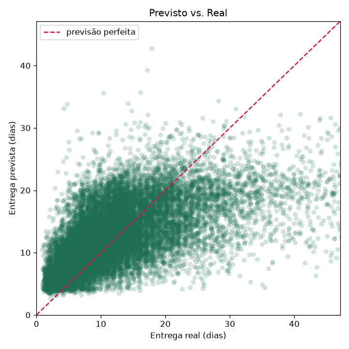

# Previsão de Tempo de Entrega — Olist (FastAPI + Docker)

Modelo que estima **em quantos dias** um pedido de e-commerce será entregue, **servido
por uma API FastAPI empacotada em Docker**. O foco não é um modelo sofisticado — é a
**cadeia completa**: dado → modelo → API → container (MLOps básico).

## O problema

Saber o prazo de entrega com antecedência ajuda o e-commerce a definir expectativa do
cliente, priorizar logística e sinalizar pedidos em risco de atraso. Aqui o alvo é o
**tempo de entrega em dias** (da compra até a chegada ao cliente).

## Dataset

**Olist Brazilian E-Commerce** (dados reais de ~100 mil pedidos). Usamos as tabelas de
pedidos, itens, produtos, clientes e vendedores, unidas por suas chaves. Após filtrar
apenas pedidos **entregues** com datas válidas e remover outliers de prazo, sobraram
**96.406 pedidos**.

> `data/` não é versionado — veja **[Como rodar](#como-rodar)** para baixar.

## Abordagem

- **Alvo**: `delivery_days = entrega − compra` (em dias).
- **Features** (nível de pedido): valor do frete, peso e volume totais, nº de itens,
  **mesma UF** (cliente × vendedor — proxy de distância), além de mês e dia da semana
  da compra.
- **Modelo**: `Pipeline` do scikit-learn (one-hot dos estados + **Gradient Boosting**),
  então a **mesma transformação** vale no treino e na inferência. O Pipeline completo é
  salvo em `models/modelo.joblib`.

## Resultado

Erro em **dias** no conjunto de teste (20%), valores desta execução real:

| Modelo | MAE | RMSE |
|---|---:|---:|
| Baseline (prever a média) | 6.43 | 9.21 |
| **Gradient Boosting** | **4.94** | 7.58 |

O modelo erra em média **~5 dias**, contra ~6,4 do baseline — ganho real ao usar frete,
peso/volume, proximidade geográfica e sazonalidade.



## A API

Sobe o modelo salvo e expõe:

| Método | Rota | Função |
|---|---|---|
| `GET` | `/health` | status do serviço e se o modelo carregou |
| `POST` | `/predict` | recebe as features do pedido e devolve os dias previstos |

**Exemplo real** (request → response):

```bash
curl -X POST http://127.0.0.1:8000/predict -H "Content-Type: application/json" -d '{
  "freight_value": 85.0, "product_weight_g": 9000, "product_volume_cm3": 40000,
  "n_items": 3, "customer_state": "AM", "seller_state": "SP", "purchase_date": "2017-12-20"
}'
# -> {"dias_previstos": 29.4}
```

(SP → Amazonas, pedido pesado: ~29 dias. Um SP → SP leve dá ~12 dias.)
Documentação interativa em `http://127.0.0.1:8000/docs`.

## Como rodar

```bash
# 1. Ambiente
python -m venv .venv && source .venv/bin/activate
pip install -r requirements.txt

# 2. Dataset Olist em data/ (escolha UMA fonte)
#   (a) Kaggle (canônica — requer ~/.kaggle/kaggle.json):
kaggle datasets download -d olistbr/brazilian-ecommerce -p data/ --unzip
#   (b) Espelho público usado neste projeto (sem credencial):
HF="https://huggingface.co/datasets/aviahYadler/Olist_Ecommerce_Dataset/resolve/main"
for f in orders order_items products customers sellers; do
  curl -sL -o "data/olist_${f}_dataset.csv" "$HF/olist_${f}_dataset.csv"
done

# 3. Treinar (gera models/modelo.joblib e as figuras)
python -m src.train

# 4. Subir a API
uvicorn api.main:app --reload      # http://127.0.0.1:8000/docs
```

### Com Docker

```bash
docker build -t previsao-entrega .
docker run -p 8000:8000 previsao-entrega
# a API responde em http://127.0.0.1:8000
```

## Estrutura

```
src/data.py      # junção das tabelas do Olist
src/features.py  # alvo (dias) + engenharia de features por pedido
src/train.py     # pipeline, treino, avaliação, salva o modelo
api/main.py      # FastAPI: /health e /predict
api/schema.py    # contratos Pydantic de entrada/saída
models/          # modelo.joblib (versionado — a API precisa dele)
notebooks/       # 01_eda_modelagem.ipynb — EDA + modelagem
Dockerfile
```

## Limitações

- O modelo usa atributos do pedido, **sem dados de trânsito/operação logística real** —
  por isso entregas atípicas (muito longas) são as mais difíceis (cauda do resíduo).
- "Distância" é aproximada por **mesma UF**; usar a distância real entre CEPs
  (via geolocalização do Olist) tende a melhorar.
- O foco é a **esteira ponta-a-ponta** (modelo → API → Docker), não espremer a métrica.

> Todos os números vêm da execução real de `python -m src.train`. Nada inventado.
> O `models/modelo.joblib` é versionado para a API funcionar para quem clonar (400 KB).

## 📫 Contato

[](https://www.linkedin.com/in/david-oliveira-9970a42a5)
[](https://github.com/david-oliveira-dev)
